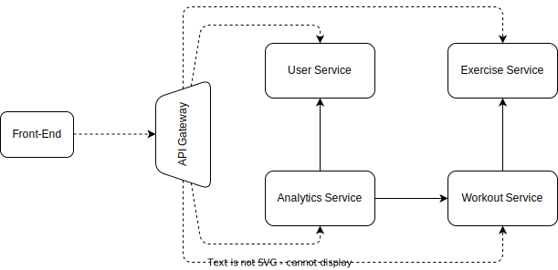
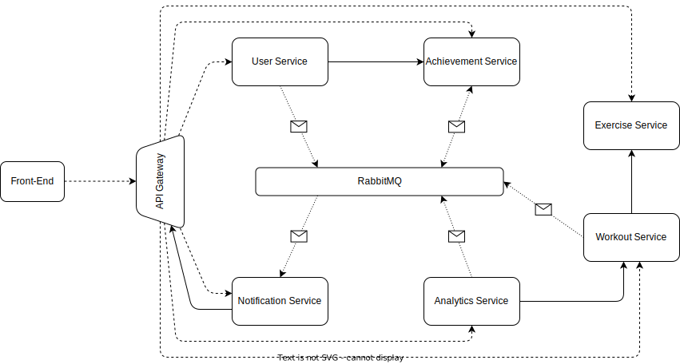
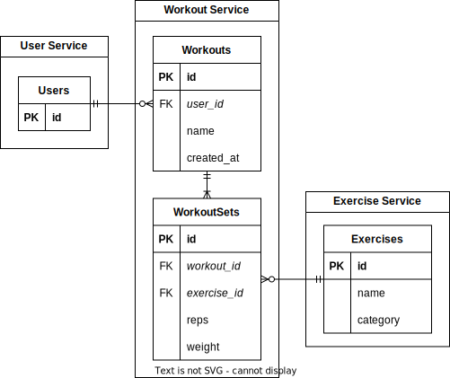

# Workout Tracker Web Application Architecture

## Table of Contents

- [System Overview](#system-overview)
- [Microservices Architecture](#microservices-architecture)
- [Database Strategy](#database-strategy)
- [API Contracts and Communication](#api-contracts-and-communication)
- [Authentication and Authorization](#authentication-and-authorization)
- [Front-end Architecture](#front-end-architecture)
- [Deployment Strategy](#deployment-strategy)
- [Monitoring and Logging](#monitoring-and-logging)

---

## System Overview

The **Workout Tracker** Web Application is designed as a distributed system, consisting of multiple microservices and a
front-end client application. These components are developed using [Angular](https://angular.io/) for the front-end and
[Spring](https://spring.io/) and [Express](https://expressjs.com/)
for the back-end microservices.

---

## Front-end Architecture

The front-end is built using [Angular](https://angular.io/). It interacts with the microservices through HTTP APIs and
updates the UI accordingly. It's also responsible for client-side routing and state management.

---

## Microservices Architecture

This project includes two architectures: _MVP_ and _Optional_.
The _MVP_ architecture includes the base features of the project, the _Optional_ architecture extends the MVP with the
addition of message queues in the form of [RabbitMQ](https://www.rabbitmq.com/) which will be predominantly used by the
newly added Notification and Achievement services.

### MVP Architecture

#### API Gateway

- **Responsibilities**: Acts as a single entry point for all client requests. The requests are authenticated and if
  authorized routed to the appropriate microservice.
- **Tech Stack**:
  Java, [Spring](https://spring.io/), [Spring Cloud Gateway](https://spring.io/projects/spring-cloud-gateway)

#### User Service

- **Responsibilities**: Handles user registration, login and user profile management. It also tracks personal
  information of the user and user-specific measurements.
- **Tech Stack**:
  Java, [Spring Security](https://spring.io/projects/spring-security), [PostgreSQL](https://www.postgresql.org/)

#### Workout Service

- **Responsibilities**: Manages the CRUD operations for workouts, including adding exercises to a workout. It also
  handles the progress-tracking for the workouts and exercises per user.
- **Tech Stack**: NodeJS, [Express](https://expressjs.com/), [PostgreSQL](https://www.postgresql.org/)

#### Exercise Service

- **Responsibilities**: Manages the CRUD operations for exercises.
- **Tech Stack**: NodeJS, [Express](https://expressjs.com/), [PostgreSQL](https://www.postgresql.org/)

#### Analytics Service

- **Responsibilities**: Analyzes user progress data to provide insights and visualizations.
- **Tech Stack**: Java, [Spring](https://spring.io/)

### Optional Architecture

#### Notification Service

- **Responsibilities**: Listens to notification event from other services and sends notifications to users about
  completed actions (user creation, workout completion, ...), achievements, and milestones.
- **Tech Stack**: Java, [Spring](https://spring.io/), [PostgreSQL](https://www.postgresql.org/)

#### Achievement Service

- **Responsibilities**: Tracks the user's progress for predefined achievements and milestones by listening to events
  from the other services. When a milestone is reached, it pushes a notification event into the queue.
- **Tech Stack**: Java, [Spring](https://spring.io/), [PostgreSQL](https://www.postgresql.org/)

---

## API Contracts and Communication

The front-end communicates with the microservices via RESTful APIs. We use [OpenAPI](https://www.openapis.org/) to
define the API contracts, which allows for strong typing of API calls and eases the integration between the front-end
and back-end. For the asynchronous communication we use [RabbitMQ](https://www.rabbitmq.com/) for Message Queues and to
allow an event-driven architecture.

---

## Monitoring and Logging

Basic monitoring is implemented with [Spring Boot Actuator](), [Prometheus](https://prometheus.io/)
and [Grafana](https://grafana.com/). Logging implemented
using [Log4J](https://logging.apache.org/log4j/2.x/) and the [ELK-Stack](https://www.elastic.co/de/elastic-stack) is
used for log aggregation.

---

## Database Strategy

We adopt a **[Database per Service](https://microservices.io/patterns/data/database-per-service.html)** strategy, where
each microservice has its own dedicated database. This ensures loose coupling and high cohesion among the
services. [PostgreSQL](https://www.postgresql.org/) is the chosen database technology for most of the services due to
its robustness, feature set, and popularity. Furthermore, the data schema for our services is known beforehand with the
requirement for complex queries, which lends itself well to using a relational DB.

### Database Schema Overview

#### Workout-Exercise Schema

---

## Deployment Strategy

Given the aim for cost-effectiveness, all microservices and the front-end application are planned to be deployed on a
single [DigitalOcean Droplet](https://www.digitalocean.com/products/droplets). Each component is containerized using
[Docker](https://www.docker.com/) for easier deployment and management.

