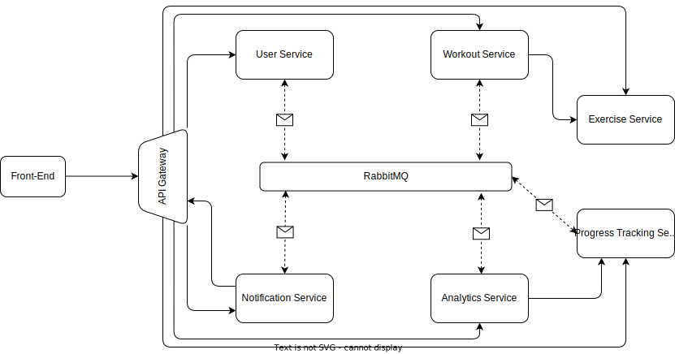

# Workout Tracker Web Application Architecture

## Table of Contents

- [System Overview](#system-overview)
- [Microservices Architecture](#microservices-architecture)
- [Database Strategy](#database-strategy)
- [API Contracts and Communication](#api-contracts-and-communication)
- [Authentication and Authorization](#authentication-and-authorization)
- [Front-end Architecture](#front-end-architecture)
- [Deployment Strategy](#deployment-strategy)
- [Monitoring and Logging](#monitoring-and-logging)

---

## System Overview

The Workout Tracker Web Application is designed as a distributed system, consisting of multiple microservices and a
front-end client application. These components are developed using [Angular](https://angular.io/) for the front-end and
[Spring](https://spring.io/) and [Express](https://expressjs.com/) for the back-end microservices.

---

## Microservices Architecture

The microservices communicate synchronously via RESTful APIs over HTTP specified
with . The system is divided into the following microservices:

### API Gateway

- **Responsibilities**: Acts as a single entry point for all client requests and routes them to the appropriate
  microservice.
- **Tech Stack**: Java, Spring, Spring Cloud Gateway

### User Service

- **Responsibilities**: Handles user registration, login, logout, and user profile management.
- **Tech Stack**: Java, Spring, PostgreSQL

### Workout Service

- **Responsibilities**: Manages the creation, updating, and deletion of workouts, including adding exercises to a
  workout.
- **Tech Stack**: Java, Spring, PostgreSQL

### Exercise Service

- **Responsibilities**: Manages the creation, updating, and deletion of exercises.
- **Tech Stack**: Java, Spring, PostgreSQL

### Progress Tracking Service

- **Responsibilities**: Tracks and stores user progress, including completed workouts and body measures.
- **Tech Stack**: Java, Spring, PostgreSQL

### Analytics Service

- **Responsibilities**: Analyzes user progress data to provide insights and visualizations.
- **Tech Stack**: NodeJS, Express

### Notification Service

- **Responsibilities**: Sends notifications to users about achievements, milestones, and reminders.
- **Tech Stack**: Java, Spring, RabbitMQ

---

## Database Strategy

We adopt a **Database per Service** strategy, where each microservice has its own dedicated database. This ensures loose
coupling and high cohesion among the services. PostgreSQL is the chosen database technology for most of the services due
to its robustness, feature set, and compatibility with Java Spring.

### Data Synchronization

Data synchronization across services is managed through an event-driven architecture using RabbitMQ. When a significant
event occurs in one service, it publishes an event message to a RabbitMQ queue. Other services that depend on this data
subscribe to the relevant queues and update their local databases or caches accordingly.

#### Examples:

- **Workout Completion**: When a user completes a workout, the "Progress Tracking Service" updates its database and
  sends a "WorkoutCompleted" event. The "Analytics Service" is subscribed to this event. Upon receiving it, the service
  updates its local database and may recalculate aggregated metrics.

- **User Registration**: On a new user registration, the "User Service" would publish a "UserRegistered" event. Services
  like "Analytics Service" may initialize a new profile for analytics based on this event.

By using this strategy, we ensure that each service can operate independently and that the system can easily scale both
horizontally and vertically.

---

## API Contracts and Communication

The front-end communicates with the microservices via RESTful APIs. We use [OpenAPI](https://www.openapis.org/) to
define the API contracts, which allows for strong typing of API calls and eases the integration between the front-end
and back-end. For the asynchronous communication we use [RabbitMQ](https://www.rabbitmq.com/) for Message Queues and to
allow an event-driven architecture.

---

## Authentication and Authorization

- **Provider**: OAuth2 authentication is done with Keycloak as the Identity Provider.
- **Backend**: Spring Security is used for handling authorization on the backend. Upon successful authentication, a JWT
  token is issued and sent back to the frontend.
- **Frontend**: Angular uses the Keycloak JS Adapter for managing OAuth2 tokens.
- **Token Storage**: JWTs are stored in HttpOnly cookies to mitigate the risk of XSS attacks.
- **API Gateway**: Spring Cloud Gateway acts as a filtering layer, enforcing access controls before requests hit the
  individual microservices.

This setup ensures a robust, secure, and centralized authentication system suitable for a microservices architecture.

---

## Front-end Architecture

The front-end is built using Angular. It interacts with the microservices through HTTP APIs and updates the UI
accordingly. It's also responsible for client-side routing and state management.

---

## Deployment Strategy

Given the aim for cost-effectiveness, all microservices and the front-end application are planned to be deployed on a
single DigitalOcean Droplet. Each component is containerized using Docker for easier deployment and management.

---

## Monitoring and Logging

Basic monitoring and logging are implemented using Spring Boot’s Actuator and logging capabilities. Metrics are exposed
via endpoints and can be collected for future monitoring solutions.